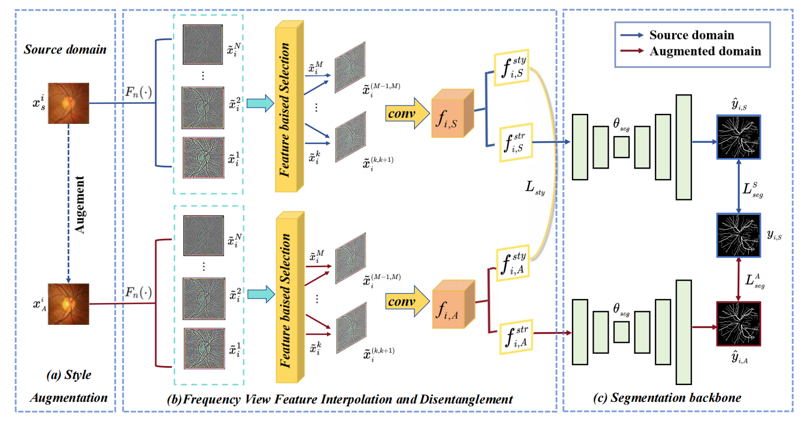

# 📘 FVFDSDG



**Paper Title:** Frequency View Feature Interpolation and Disentanglement for Single-Source Domain Generalization in Retinal Vessel Segmentation  
**Journal:** *Biomedical Signal Processing and Control*, 2026, Vol.112, 108814  
**DOI:** [https://doi.org/10.1016/j.bspc.2025.108814](https://doi.org/10.1016/j.bspc.2025.108814)  
**Authors:** Linda Ma, Jia-Xuan Jiang, Shubin Zeng, Yuee Li, Zhong Wang  
**Affiliation:** School of Information Science and Engineering, Lanzhou University  

---

## 🧠 Introduction
This project proposes a **single-source domain generalization framework** named **FVFDSDG**, designed to address the domain shift problem in medical image segmentation.  
The framework performs **Frequency View Disentanglement** and **Structure Frequency View Interpolation (SFVI)** to enhance cross-domain segmentation robustness using only a single-source dataset.

---

## 🚀 Key Contributions
- Propose the **Gaussian Frequency Views Disentanglement framework**, enabling multi-scale frequency feature decomposition.  
- Design the **Structure Frequency View Interpolation (SFVI)** module to generate structure-aware interpolated samples across domains.  
- Introduce an **attention mechanism** to separate structural and style features for improved generalization.  

---

## 🧰 Data Preparation

**Datasets and Download Links:**  
- [DRIVE](https://drive.grand-challenge.org/)  
- [CHASE_DB1](https://blogs.kingston.ac.uk/retinal/chasedb1/)  
- [STARE](https://paperswithcode.com/dataset/stare)  
- [IOSTAR](http://www.retinacheck.org/download-iostar-retinal-vessel-segmentation-dataset)

---

### 📁 Dataset Organization
After preprocessing, the dataset directory should be organized as follows:

```
DataSet/
├── DRIVE/
│   ├── DRIVE_train.csv
│   ├── DRIVE_test.csv
│   └── ...
├── CHASEDB/
│   ├── CHASEDB_test.csv
│   └── ...
├── STARE/
│   ├── STARE_test.csv
│   └── ...
└── IOSTAR/
    ├── IOSTAR_train.csv
    ├── IOSTAR_test.csv
    └── ...
```

> Each `.csv` file records the image and mask paths for training or testing.  
> Images are stored as `.jpg` or `.png`, and masks are named with `_mask.png` or `_1stHO.png` suffixes.

---

## ⚙️ Usage Instructions

### 1️⃣ Environment Setup
- Python ≥ 3.9  
- PyTorch ≥ 1.12  
- CUDA ≥ 11.3  
- Required packages: numpy, opencv-python, matplotlib, tqdm, etc.  
- Recommended GPU: RTX 3080 Ti (12GB VRAM)

---

### 2️⃣ Training & Inference
```bash
# Set Python path (required for first run)
export PYTHONPATH=$(pwd):$PYTHONPATH

# Start training
python deeplearning/training/run_training.py   --log_folder <log_folder>   --root <dataset_root>   --tr_csv <training_csv>   --ts_csv <test_csv1> <test_csv2> ...   --model <model_name, e.g., unet_fvfdsdg>   --batch_size 8   --num_epochs 100   --initial_lr 0.01   --gpu 0   --save_interval 25
```

> **Arguments:**  
> - `<log_folder>`: directory to save logs and model checkpoints  
> - `<root>`: dataset root directory  
> - `<tr_csv>`: training CSV file (path index)  
> - `<ts_csv>`: one or multiple testing CSV files  
> - `<model>`: model name (e.g., unet_fvfdsdg)

---

## 📄 Citation
```bibtex
@article{Ma2026FVFDSDG,
  title = {Frequency View Feature Interpolation and Disentanglement for Single-Source Domain Generalization in Retinal Vessel Segmentation},
  author = {Ma, Linda and Jiang, Jia-Xuan and Zeng, Shubin and Li, Yuee and Wang, Zhong},
  journal = {Biomedical Signal Processing and Control},
  volume = {112},
  pages = {108814},
  year = {2026},
  doi = {10.1016/j.bspc.2025.108814},
  issn = {1746-8094},
  url = {https://www.sciencedirect.com/science/article/pii/S1746809425013254}
}
```

---

## 💡 Acknowledgements
This research was supported by the **Gansu Provincial Natural Science Foundation (25JRRA666)**  
and the **Fundamental Research Funds for the Central Universities of Lanzhou University (lzujbky-2023-it40, lzujbky-2024-it52)**.  
We thank the open-source community and the providers of the public retinal datasets used in this work.
